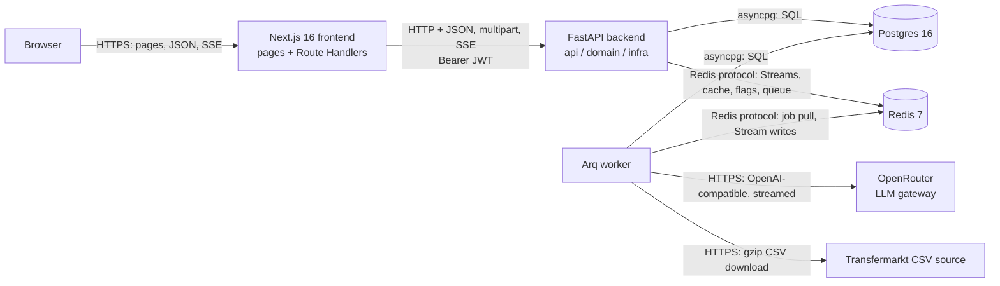

# World Cup AI Scout

World Cup AI Scout is a chat application that answers questions about the FIFA World Cup 2026 using tournament data. A user asks about a team, a match or a player, or asks for a comparison. An LLM decides which analytics tools to call. The tools query Postgres, and the answer streams back to the browser as text plus structured widgets (team, match, player and comparison cards).

The system has five runtime pieces: a **Next.js** frontend, a **FastAPI** backend, an **Arq worker**, **Postgres** and **Redis**. External calls go to **OpenRouter** (LLM) and a **Transfermarkt CSV source** (real-world enrichment data).

- [Architecture at a glance](#architecture-at-a-glance)
- [Components](#components)
- [How components communicate](#how-components-communicate)
- [Why this architecture](#why-this-architecture)
- [Key flows](#key-flows)
- [Running locally](#running-locally)
- [Repository layout](#repository-layout)

## Architecture at a glance



Two rules shape the diagram:

1. The browser only talks to Next.js. Next.js talks to FastAPI on the server side, and the JWT never reaches browser JavaScript.
2. Long-running work (LLM replies, ingestion) runs in the worker. It reaches the browser through Redis Streams and the `ingestion_job` table, never through the request that started it.

## Components

| Component | Problem it solves | Key tech | Where |
|---|---|---|---|
| Frontend | Renders the chat, widgets, sidebar and admin screens. Keeps the session token out of browser JavaScript. Hides the backend URL from the browser. | Next.js 16 (App Router, `cacheComponents`), React, Tailwind, shadcn/ui | `frontend/` |
| Route Handlers (BFF proxy) | Server-side gateway between browser and backend. Reads the JWT from an httpOnly cookie and forwards it as a Bearer token. | `proxyBackendJson`, `proxyBackendMultipart`, streaming SSE pass-through | `frontend/src/app/api/`, `frontend/src/lib/api/` |
| Auth gate | Redirects unauthenticated visitors to `/login` (presence check only; the backend verifies the JWT). | Next.js `proxy.ts` | `frontend/src/proxy.ts` |
| Backend API | Validates requests, enforces auth and ownership, returns DTOs. Contains no long-running work. | FastAPI, Pydantic v2, PyJWT | `backend/src/api/v1/` |
| Domain layer | Business rules and use cases: chat turn orchestration, the tool-calling loop, ingestion and identity matching. Independent of HTTP and of concrete infrastructure. | Plain Python models, services, exceptions | `backend/src/domain/` |
| Infrastructure layer | One facade per external dependency, behind interfaces (`Protocol`). Concrete repositories are private and exposed only through DI providers. | SQLAlchemy 2 async, redis-py, httpx, Arq | `backend/src/infra/` |
| Arq worker | Runs work that must not block request handlers or die with a client connection: chat replies, conversation categorization, ingestion jobs. | Arq 0.28 | `backend/src/infra/task_queue/` |
| Postgres | Durable source of truth: tournament data, real-world enrichment data, chat history, job records. | Postgres 16, asyncpg, Alembic | `backend/src/infra/postgres/`, `backend/migrations/` |
| Redis | Job queue, per-turn coordination flags, event streams for realtime updates, and a prompt-history cache. | Redis 7 | `backend/src/infra/redis/`, `backend/src/infra/task_queue/` |
| LLM gateway | Provider-independent LLM access with tool calling, streamed reasoning, prompt caching and model fallback. | OpenRouter (OpenAI-compatible API) | `backend/src/infra/openrouter/` |
| Transfermarkt source | Club-level player, valuation, transfer and season data that the tournament dataset lacks. | httpx, gzip CSV | `backend/src/infra/transfermarkt/` |

### Data held in Postgres

| Group | Tables (examples) | Purpose |
|---|---|---|
| Synthetic tournament | `national_team`, `player`, `player_stat`, `match`, `match_event`, `match_team_stat`, `match_lineup`, `venue`, `referee`, `tournament_stage` | The World Cup 2026 dataset the analytics tools query. |
| Real enrichment | `real_player`, `real_player_valuation`, `real_transfer`, `real_player_season_stat`, `real_club`, `real_club_game`, `real_game_lineup`, `real_match_event` | Transfermarkt data for club-level context. |
| Identity links | `player_identity_link` | Joins a tournament-dataset player to a Transfermarkt player. Carries match method, confidence and a review status (`pending`, `approved`, and a rejected state). |
| Chat | `conversation`, `chat_message`, `chat_message_widget`, `chat_turn_failure` | Durable, append-only chat history and widget payloads. |
| Operations | `user`, `ingestion_job` | Accounts and asynchronous job status (`queued`, `running`, `succeeded`, `failed`). |

Schemas: `backend/src/infra/postgres/schemas/`.

### Analytics tools exposed to the LLM

Registered in `backend/src/domain/chat/tools/registry.py`: `get_team_analysis`, `get_team_comparison`, `get_player_analysis`, `get_player_comparison`, `get_match_analysis`, `query_player_stats` and `get_current_utc_time`. Each validates its arguments with a Pydantic model and queries Postgres through a repository interface.

## How components communicate

One row per real edge in the system.

| From → To | Protocol | Why this protocol |
|---|---|---|
| Browser → Next.js (pages, actions) | HTTPS, HTML and JSON `fetch` | Standard web delivery. Auth is an httpOnly cookie (`fai_session`), so the browser never holds the token. |
| Browser → Next.js (live updates) | Server-Sent Events via `EventSource` (`GET /api/conversations/{id}/events`, `GET /api/users/events`) | Server-to-client push only, over plain HTTP. `EventSource` sends the cookie automatically and reconnects with `Last-Event-ID`. See [SSE over WebSocket](#sse-over-websocket). |
| Next.js → FastAPI (JSON) | HTTP + JSON, `Authorization: Bearer <JWT>` | Stateless, cacheable-by-design REST. The backend authorizes each request independently of the frontend. |
| Next.js → FastAPI (CSV upload) | `multipart/form-data` | Native format for file uploads. The proxy forwards the `FormData` unchanged, so the backend's structured per-file rejection body survives. |
| Next.js → FastAPI (live events) | SSE (`text/event-stream`), response body piped through | The proxy returns the backend's `ReadableStream` as-is. Buffering it would hold back an intentionally endless stream. |
| FastAPI → Postgres | PostgreSQL wire protocol via asyncpg (SQLAlchemy 2 async) | Non-blocking I/O on the event loop. Relational data with joins and aggregation done in SQL. |
| FastAPI → Redis (enqueue) | Redis protocol, Arq `enqueue_job` | Hands work to the worker without blocking the request. |
| FastAPI → Redis (coordination) | Redis protocol: `SET NX EX` flag, `XADD`, `XREAD BLOCK`, `MGET` | Atomic one-turn-per-conversation guard. Streams give an ordered, replayable log for SSE readers. |
| Worker → Redis | Redis protocol: Arq job pull, `XADD`, `SET`/`EXPIRE`/`DEL` | The same queue and streams the API uses. No direct API-to-worker connection is needed. |
| Worker → Postgres | PostgreSQL wire protocol via asyncpg | Persists replies, widgets, job status and ingested rows in the worker's own session. |
| Worker → OpenRouter | HTTPS, OpenAI-compatible `POST /chat/completions` with `stream: true` (SSE response) | One request shape for many providers. Streaming carries reasoning and content deltas and tool-call fragments. |
| Worker → Transfermarkt source | HTTPS `GET {base}/{table}.csv.gz` | Bulk static files. Decompression and CSV parsing run in a threadpool so the loop stays free. |

Notes:

- The API does not call the worker directly and the worker does not call the API. Redis and Postgres are the only shared state.
- There is no pub/sub. All realtime fan-out uses Redis Streams, which keep entries so a reader can catch up.
- The API also uses `XREAD`/`XREVRANGE` to serve SSE, so the API process both writes to and reads from the same streams the worker writes to.

## Why this architecture

The repository records some of its own reasoning in [`creation_blog.md`](creation_blog.md) and in commit messages. Where a rationale is recorded, it is quoted or paraphrased below. Where it is not, the tradeoff is stated neutrally.

### Next.js as a BFF proxy in front of FastAPI

- **Decision:** the browser calls only Next.js Route Handlers (`frontend/src/app/api/**`). They call FastAPI server-side.
- **Problem:** the JWT must not be readable by browser JavaScript, and the backend URL should not be exposed. The session token lives in an httpOnly cookie (`frontend/src/lib/auth/session.ts`).
- **Tradeoff:** every backend endpoint the UI needs has a matching Route Handler. Streaming responses need a dedicated pass-through handler. The frontend auth gate only checks that the cookie exists; the backend verifies the JWT on every request.

### Hexagonal backend (layer-first)

- **Decision:** `api/` handles HTTP and DTOs, `domain/` holds models and use-case services, `infra/` wraps each external dependency behind interfaces. Conventions are in [`AGENTS.md`](AGENTS.md).
- **Problem:** Postgres, Redis, OpenRouter and Transfermarkt should be replaceable without touching business logic or routers. Simple reads can go from a router straight to a repository interface. Multi-step use cases live in domain services.
- **Tradeoff:** more files and indirection than a flat FastAPI app. Each repository needs an interface, a private implementation and a DI provider.

### Background worker and queue (Arq)

- **Decision:** chat replies, conversation categorization and all ingestion run as Arq jobs (`backend/src/infra/task_queue/worker.py`).
- **Problem:** `chat_tasks.py` documents the original failure. When the reply was generated inside a streaming response, a client disconnect cancelled the generator before it could persist. Running it as a job means the reply finishes and persists regardless of who is watching. Ingestion jobs (for example a Transfermarkt sync; one of its files is about 126 MB decompressed, per `worker.py`) exceed request timeouts and need durable status, which the `ingestion_job` table provides.
- **Tradeoff:** an extra process to run, and results arrive asynchronously. The API returns `202` or a job id, and clients poll (`GET /admin/ingestion/jobs/{id}`) or read a stream. Timeouts are per function: 300 s for chat replies, 60 s for categorization, 3600 s for Transfermarkt sync.

### SSE over WebSocket

- **Decision:** send with `POST /conversations/{id}/messages`, receive with SSE. The chat previously used a per-conversation WebSocket.
- **Problem (recorded in the repository):** the WebSocket needed a ticket-minting auth flow because it could not carry the httpOnly session cookie, and it only reached clients watching that one conversation. SSE was chosen because it "rides ordinary HTTP through any proxy/LB without WS-specific config", removes the ticket system, and provides native reconnect through `Last-Event-ID`, which matches the Redis Stream cursor model.
- **How it works:** two SSE endpoints read Redis Streams.
  - `GET /conversations/{id}/events` reads the per-conversation turn stream (`chat:turn-stream:{id}`). An in-progress turn replays from the cursor stored when the turn was reserved, so a reloaded page can reattach mid-reply. An idle conversation starts at the stream tail, because history already comes from Postgres.
  - `GET /users/events` reads a per-user stream (`user:events:{user_id}`) for account-wide events (`conversation_created`, `conversation_updated`, `conversation_touched`), so every open device updates its sidebar. `conversation_touched` carries the real `updated_at` and is published when a message is sent and again when the turn ends, so a conversation moves to the top of "Today" in every open tab.
- **Tradeoff:** SSE is one-directional, so sending needs a separate POST. Cancelling a running turn is not implemented. Streams have retention limits: turn streams expire 900 s after a turn ends, and the per-user stream is trimmed to about 1000 entries.

### OpenRouter instead of a single-vendor SDK

- **Decision:** one OpenAI-compatible client (`backend/src/infra/openrouter/client.py`) with a model list in `OPENROUTER_MODELS`, sent as the request's `models` array.
- **Problem (from the blog):** availability across providers, streamed reasoning ("thinking") for a smoother UX, tool calling, prompt caching and token limits without one integration per vendor. If the primary model is down, the request falls through to the next one in the list.
- **Recorded caveats:** OpenRouter is itself a single point of failure. Prompt caching only works within a provider, so a fallback model loses cache benefit and may change response style. The author accepted both for a demo-stage app.
- **Where it applies:** the client marks the system prompt with an ephemeral cache breakpoint. The tool loop is capped at 5 iterations per turn (`MAX_ITERATIONS`).

### Synthetic tournament data plus real Transfermarkt data with audited links

- **Decision:** the tournament dataset is loaded from CSVs (git-ignored `data/FIFA-World-Cup-2026-Dataset`, via the admin ingestion API or a seed script). Real Transfermarkt tables are synced separately. `player_identity_link` connects the two ID spaces.
- **Problem:** the two sources share no key. Matching uses exact name plus date of birth, exact name plus team, and fuzzy name similarity (`rapidfuzz`). Fuzzy matches get confidence below the exact ones, and an admin can approve, reject or reassign each link in the admin UI.
- **Tradeoff:** an automatic match can be wrong, so a human review step exists and rejections are stored explicitly rather than deleted. Clean re-matching is a separate admin-triggered job.

### Postgres as source of truth, Redis as coordination layer

- **Decision:** chat history is an append-only log in Postgres (`chat_message`, widgets in `chat_message_widget`). Redis holds a 24-hour prompt-history cache, the per-conversation in-progress flag and the event streams.
- **Problem (from the chat-memory notes):** Redis-only history was lossy and TTL-bound, so a restart or Redis failure lost conversations and there was no way to list them. `GET /conversations/{id}/messages` therefore reads Postgres directly, because the cache has no widget data.
- **History rebuild:** when the Redis cache is empty (24-hour expiry, flush, or a failed turn), the prompt history is rebuilt from Postgres and written back to the cache. Only completed user and assistant text pairs, in `sequence` order, are rebuilt. Widgets, metadata, reasoning, tool messages and the system prompt are never part of it, so the prompt prefix stays identical to what the model saw and the provider's KV cache keeps hitting. Orphan user messages from failed turns are dropped, and the oldest whole turns are dropped once the history exceeds `CHAT_HISTORY_TOKEN_BUDGET` (default 50,000 tokens, counted with `tiktoken`, with a `len/4` fallback if the encoding cannot load). Windowing runs only on a rebuild, not on a cache hit.
- **Tradeoff:** two stores to keep consistent. The design accepted synchronous writes and deferred any outbox or CDC mechanism.

## Key flows

### 1. A chat turn, end to end

1. The browser sends `POST /api/conversations/{id}/messages`. The Route Handler attaches the JWT from the cookie and forwards the call to `POST /api/v1/conversations/{id}/messages`.
2. FastAPI checks conversation ownership and does a get-or-create of the conversation. For a new conversation it enqueues `categorize_conversation_task` and publishes `ConversationCreatedEvent` to the user stream.
3. FastAPI reserves the turn with `SET chat:turn-in-progress:{id} <cursor> NX EX 300`. If the key exists it returns `409`.
4. FastAPI persists the user message in Postgres, touches the conversation's `updated_at` and publishes `conversation_touched` to the user stream, appends a `UserMessageEvent` to `chat:turn-stream:{id}`, enqueues `generate_chat_reply_task` and returns `202`.
5. The browser already holds an `EventSource` on `/api/conversations/{id}/events`. The Route Handler pipes the backend SSE stream through, so the user message shows on every device watching that conversation.
6. The worker loads the cached history (rebuilt from Postgres on a cache miss), calls OpenRouter with streaming enabled and runs the tool loop. Each tool validates its arguments and queries Postgres.
7. Every event (reasoning delta, content delta, tool call, widget ready, message done) is appended to the turn stream. SSE readers forward each entry as an `event: turn` frame with the stream id as `id:`.
8. The worker persists the assistant message and widgets, touches the conversation again (publishing `conversation_touched`), refreshes the Redis history cache, deletes the in-progress flag and sets a 900 s TTL on the stream.
9. If the reply fails outright, the worker writes a `chat_turn_failure` row and publishes an error entry. `GET /conversations/{id}/messages` returns it as `last_turn_failure`.

### 2. An admin ingestion job

1. An admin uploads CSVs in the admin UI (`(admin)/sync-jobs`) or triggers a Transfermarkt sync or an identity re-match. Route Handlers under `/api/admin/**` forward the request as JSON or `multipart/form-data`.
2. The backend endpoint requires an admin JWT (`require_admin`), creates an `ingestion_job` row with status `queued` and enqueues the matching Arq task. It returns `201` with a job id.
3. The worker marks the job `running`, ingests in batches, and records stage checkpoints for the bulk upload. For a Transfermarkt sync it downloads `{table}.csv.gz` files, upserts them, then runs identity matching that produces pending `player_identity_link` rows.
4. On any failure, including a timeout cancellation, the task rolls back and marks the job `failed` with an error message.
5. The frontend polls `GET /api/admin/ingestion/jobs/{jobId}` until the job is `succeeded` or `failed`. Pending links appear in the identity-link review page for approval, rejection or reassignment.

Upload payloads travel through Redis as bytes in the job arguments, because API and worker run in separate containers with separate filesystems.

### 3. Login

1. The login page posts email and password to `POST /api/auth/login`.
2. The Route Handler forwards them to `POST /api/v1/auth/login`. The backend verifies the credentials against the `user` table and returns a self-issued JWT (HS256, `JWT_*` settings).
3. The Route Handler stores the token in the httpOnly `fai_session` cookie (`sameSite=lax`, `secure` in production) and returns only `{ "ok": true }` to the browser.
4. `src/proxy.ts` redirects requests without the cookie to `/login`. Later Route Handlers read the cookie server-side and send it as a Bearer token.

## Running locally

Prerequisites: Docker with Compose. The dataset directory `data/FIFA-World-Cup-2026-Dataset` is git-ignored and must be cloned separately if you want to use the seed script.

```bash
# 1. Environment files (templates use a .txt suffix)
cp backend/env.example.txt backend/.env
cp frontend/env.example.txt frontend/.env.local
#    Edit backend/.env: set OPENROUTER_API_KEY, JWT_SECRET, SEED_ADMIN_* values.

# 2. Start postgres, redis, backend, worker and frontend
docker compose up --build

# 3. Create the schema
docker compose exec backend alembic upgrade head

# 4. Load tournament data and the admin user (dev-only seed script)
docker compose exec -e PYTHONPATH=/app backend python scripts/seed_from_csv.py
```

Then open `http://localhost:3000` and sign in with the seeded admin credentials. As an alternative to step 4, sign in first and upload the CSVs through the admin ingestion UI.

| Service | Host port | Notes |
|---|---|---|
| Frontend (Next.js) | 3000 | Reaches the backend as `http://backend:8000/api/v1` inside the compose network. |
| Backend (FastAPI) | 8000 | Runs with `--reload`. Interactive docs are shown when `ENVIRONMENT` is `local` or `staging`. |
| Worker (Arq) | none | Runs `arq src.infra.task_queue.worker.WorkerSettings`. |
| Postgres | 55432 | User, password and database are all `world_cup_ai_scout`. |
| Redis | 56379 | |

Tests and linting:

```bash
cd backend && pytest          # needs Postgres and Redis running
cd backend && ruff check src && ruff format src
cd frontend && npm run test   # vitest
cd frontend && npm run lint
```

## Repository layout

```
.
├── backend/
│   ├── src/api/v1/          HTTP layer per context: auth, chat, admin, matches, national_teams, players
│   ├── src/domain/          Models, services, exceptions, chat tools, ingestion and matching logic
│   ├── src/infra/           postgres, redis, openrouter, transfermarkt, task_queue (Arq worker)
│   ├── migrations/          Alembic migrations
│   ├── scripts/             seed_from_csv.py (dev-only seed)
│   └── tests/               unit and integration tests
├── frontend/
│   ├── src/app/             Thin routes, plus Route Handlers under app/api and admin pages under (admin)
│   ├── src/features/        auth, chat, identity-links, ingestion (components, hooks, api clients, schemas)
│   ├── src/components/      Shared UI (shadcn/ui primitives, layout)
│   ├── src/lib/             HTTP proxy helpers and session handling
│   └── tests/unit/          vitest tests
├── design/                  Design tokens and artboard snapshots used to build the UI
├── data/                    World Cup 2026 tournament dataset (git-ignored, cloned separately)
├── odd/                     Development task notes
├── docker-compose.yml       Local stack: postgres, redis, backend, worker, frontend
├── AGENTS.md                Coding conventions and architecture rules
└── creation_blog.md         Author's log of decisions
```
