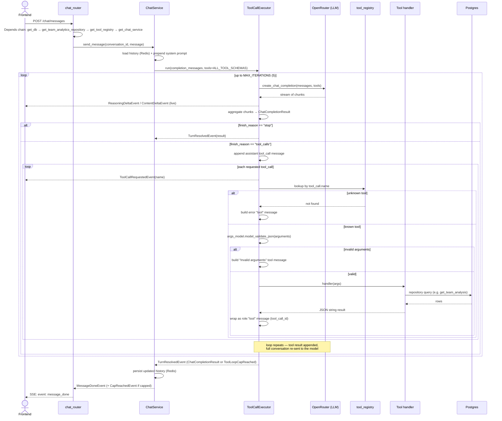

# Start 17 sept 2026. Available Data Analysis and product definition

The first sten is to analyze the available data and see which insights can be extracted. that way, I now which information I should base the system on, then lead the user to obtain. 

For that, I just asked Claude to complete an initial idea of mine, and check if the dataset had the data to do those widgets. Some of the data was missing, some was added, but I ended up adapting the information template. All of this in 20 minutes. After that, I'l just use claude to generate the designs.

## Original Idea

### Team Analysis

Explains the performance of a team in the whole tournament, how offensive or defensive the team was. How many passes per goal it has, how many goals the team took, the match results in the world cup, and some other metrics that can be found

### Match Analysis

Explains the result, the performance of both teams, the styles of play, who were the top players and why. Which players were key to the definition of the match, which team had most passes, defensive performance, and some metrics of the style

### Player Analysis

How well the player did in the tournament, goals, defensive plays, assists, miles traveled during games (if available), position and any other information of this kind that can be presented. The player should be classified in several categories, striker, brain, defensive midfielder, wall, fast-winger, and any other else that might be useful

### Players Comparison

compares the analysis of two players and generate the difference comparison among them.

What claude answered me was much like this list, it warned that some data was not there, and specified which column of the dataset correspond to the data I want to show the user. With this definition, the design system and designs for the chat feature were created. The purpose of this project is to create a RAG pipeline for this agent, so for now, this statistics I'm showing are going to serve as example. And, later on, I could develop more sophisticated analysis of the data.

After the product has been designed. I wrote the agents.md file of the project, so when generating code, the system would respect the architecture and best practices I like for FastAPI and NextJS.

# Sept 18, Projects scaffolding and selecting Ai provider

## Project Scaffolding

I started the API and frontend projects. To do that, first I generated the data structure spec with Claude, once I had it cooked, I asked Claude the implement the API project for that database structure, taking care of following my DDD architectural guidelines. 

The same for frontend, it started me a Next JS 16 project, using a feature first approach, separating UI components from app logic and integration with the API.

After that, i prepared a docker compose file, that makes easy to execute the project

## Selecting AI provider

The AI provider in a system is a big decision, a commitment that carries some risks that must be addressed before any code is written.

### LLM Agnostic and availability

To ensure availability of the service, the system must be able to easily switch between models, this way, if OpenAI of Anthropic models are down, the operations may continue with Grok, or Gemini or another model.

### Thinking Language and User Experience

Streaming the thinking language of the model is a key feature. It makes the user feel no friction while the model is operating, tells how the model has understood the request of the user, making a smoother experience.

### Tools

The tool calling is a key part in creating an agent. They are what allow the agent to interact with the system and obtain a response. To use them, a description of each tool is sent to the model in the context, and the model can choose to call a tool to solve a problem, obtaining it's result. Systems that are complex might require the agent to load a lot of different tools. That can put a lot of weight in the model context, and sometimes, if the tools aren't needed for the majority of tasks, they can be lazy loaded. 

One feature that can improve the performance of an agent is parallel tool calling, decreasing the response time for heavy operations that require several tool executions.

### Prompt Caching

The key to make the cost of the agent affordable in any reasonable production scale system is to use the prompt caching feature of some LLM providers. What it does is to save the KV values of the attention algorithm, so when a new message is appended to the conversation, the KV matrixes of values for the old messages is reused, avoiding the heavy calculation of these values. That makes the cost and response time to be slightly similar to a linear function, instead of a quadratic one.

### Monitoring

Measuring response times, time to first token and token throughput is important to have a real description of the agent's performance, and detect which tools or which prompts generate the biggest issues regarding user experience and time spent waiting. This way, those tools can be taken care of in a scientific way. The cost is also an important variable that must be taken care of, but that is handled through the Ai provider, but, it might be analyzed together with token consumption logs of the app.

So after considering this ideas, i asked Claude if there is anything else that must be taken into account before making a decision. 

- It warned me that having a single implementation for a service that allow me to use multiple models as OpenRouter is also a single point of failure, so the system could have a direct implementation for other models APIs, and that is a good safety measure, but, as this is just a test app, I wont implement that. 
- Another warning was that prompt cache is only withing the same provider, and switching models doesn't leverage cache, but since switching to another model is only for exceptional cases, that doesn't needs to be taken care of. It also says that the quality and personality of the response would change, but as it is an exception I prefer being available that having that consistency.

### How to Test LLM Apps

Since LLMs are not deterministic, it can be really challenging to monitor and test the results of an LLM, since it can vary with every new execution. Fortunately the industry has developed some tools that can help with that.

### Decision

Instead of implementing an integration for Claude, another for OpenAI, another for Gemini and so on, for me the best choice is to use OpenRouter, which allows the developers to interact with different providers through a unified interface, which supports a list of models, for the case were the main one is down, it automatically handles the request to another. It allows streaming thinking language, limiting max tokens, using tools, cache management, basically all the requirements an APP can have. And it supports a lot of LLMs to use.

## Using coding agents and worktrees for parallel implementation

To best leverage time, I recommend working in parallel, usually one heavy task and several small tasks that can be made independently. For that, first make a plan, create several workspaces with a defined objective, and then start warming up each chat instance, talk about what you want to achieve and how, ask for alternatives and things that you might be missing.

But first lets plan the tasks I have left to do 

1. Improve the designs, there were some stuff about the look and feel that could be improved (the first iteration of designs was too "squared").
2. Implement authentication in the app
  1. Sign up
  2. Log in
  3. Log out
3. Implement the chat feature
  1. Open Router Integration
  2. System Prompt
  3. Streaming Language
  4. Cache Control
  5. Performance logs
  6. Tool implementation
  7. UI implementation
4. Data ingestion
  1. API endpoints for data ingestion
  2. Docker must automatically enrich the system with data when composing the app
5. Implement each one of the custom widgets the user can see in the app
  1. **Team Analysis** — Team header (crest, name, stage reached), W-D-L record and goal difference, 3–4 key stat chips (possession, shots, goals conceded per game, clean sheets) and a goals for/against bar chart by match. Expands to full tournament averages, match-by-match results and discipline totals.
  2. **Match Analysis** — Scoreboard (teams, score, stage, date), split bars for possession/shots/shots on target, key events (goals, cards) and Player of the Match. Expands to full team stats, event timeline (goals, assists, cards, VAR, substitutions) and lineups grouped by GK/DEF/MID/FWD.
  3. **Player Analysis** — Player header (name, team, position, shirt number), stats-derived profile tags (position, goal-contribution tier, discipline), hero metric (e.g. G+A per 90) and 4 stat chips (goals, assists, shots, minutes — or saves, clean sheets, conceded for goalkeepers). Expands to totals + per-90 table with percentiles and a per-90 vs position-average chart.
  4. **Player Comparison** — Two player headers side by side, the 3–4 stats where they differ most as diverging bars with the leader highlighted, and percentile-within-position notes. Expands to a full per-90 table with percentile bars and a swap control for each player.
  5. **Match Prediction** — Win/draw/loss probabilities and most likely scorelines for an upcoming or hypothetical match (Poisson / Dixon-Coles model on goals and shots), with the key factors driving the prediction.
  6. **Team Strength Ranking** — Elo-based power ranking of teams with rating, change after the last match (▲/▼) and a rating trend sparkline across the tournament.
  7. **Similar Players (Scouting)** — Given a player, the 5 most statistically similar players (k-nearest neighbours on per-90 profiles), each with a similarity score and the stats that make them alike.
  8. **Leaderboard** — Top-N ranking for any metric (goals per 90, saves, shots on target, etc.), filterable by position and minimum minutes, with shrinkage-adjusted values for small samples.
  9. **Over/Under-Performance** — Actual goals vs. expected goals from shot volume and tournament conversion rate, showing who is finishing above or below expectation (scatter plot or ranked list).
  10. **Significance Check** — Result of a statistical test on a comparison (e.g. "Messi vs Mbappé goals per 90"), stating in plain words whether the difference is real or likely noise, with confidence intervals.
  11. **Team Form Timeline** — A team's performance across its matches (goals, shots, possession, results) as a compact timeline to show trends.
  12. **Sample-Size Indicator** — Not a standalone answer; attached to every widget. Shows minutes/matches behind the numbers, a "small sample" warning below the threshold, and confidence ranges on key figures.

## Worktrees

First two worktrees were the integration with OpenRouter and the Ingestion of the data. This way, the next step is to build the UI and finally the tools to generate the data reporting agent finally, and the UI widgets for each one of them, but that requires the OpenRouter Integration first.

## The use of PI and Open Router free models
When runned out of claude code tokens, i have just installed a new tool to learn. Pi, a light harness that can be fully customizable, and together with what i learned about OpenRouter, I will use the free models to implement some UI while claude is reloading my subscription tokens. The same harness I use in Claude, Gentle AI, is available for pi, so i can reuse the long term memory I store in a software named Engram. And continue developing

## Creating the backend tools and the frontend widgets for the tool responses
Here is a diagram of how the system reacts to a user message. And how tool execution loop processes the tool calling instructions of the model. 

